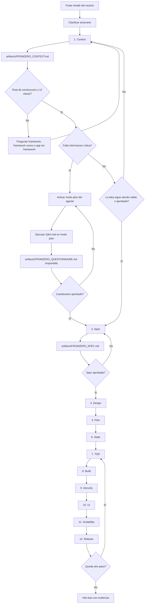

# Primeros pasos

Este documento explica como debe vivirse FromZero desde una conversación normal con el agente.

La regla principal es simple: el usuario no debe conocer nombres de skills, manifests, gates, resolver, lockfiles ni rutas internas del plugin. El adaptador traduce frases simples a procesos técnicos y muestra "verificaciones" cuando habla con el usuario.

Si eres usuario de un proyecto donde FromZero ya está instalado, tu guía es `artifacts/START_HERE.md`. Este documento explica el adaptador por dentro.

## Archivo de inicio del proyecto

Al instalar o actualizar un adaptador FromZero en un proyecto destino, el agente debe crear o actualizar bajo `artifacts/`:

```text
artifacts/START_HERE.md
```

Ese archivo es la guía simple para usuarios no técnicos. Debe explicar que se instalo, como confirmar que FromZero está listo, como iniciar con una idea vaga, con un PRD o con documentación en una carpeta, y cual sera la secuencia normal de artefactos.

El nombre visible debe ser `artifacts/START_HERE.md`, no `FROMZERO_START_HERE.md`, porque el objetivo es que cualquier persona lo encuentre sin conocer la metodología. El prefijo `FROMZERO_START_HERE` solo puede usarse como marca interna administrada dentro del archivo.

Cuando el entorno permita ejecutar scripts, usa:

```text
node tools/init-project.mjs --project <ruta-del-proyecto>
```

Durante instalación o actualización, `artifacts/START_HERE.md` se sobrescribe siempre desde `templates/start-here.md` para que la guía inicial quede alineada con la versión instalada.

Al cerrar la instalación o actualización, el agente debe copiar literalmente el bloque `Mensaje final obligatorio para el usuario` mostrado por `tools/init-project.mjs`. No debe sustituirlo por una lista resumida ni por un cierre propio, y debe conservar el enlace Markdown a `artifacts/START_HERE.md`.

Si el proyecto no tiene Git inicializado, el cierre debe recomendar inicializarlo antes de ejecutar FromZero. La justificación debe ser simple: guardar el punto de partida, revisar cambios del agente y poder volver atrás.

## Numeración visible

No uses pasos, fases, Sprints, etapas ni items visibles numerados como `0`.

La experiencia normal empieza en `1`: Paso 1, Fase 1, Sprint 1 e Item 1. Solo se permite una excepción por razón técnica extrema, documentada por escrito.

## Verificación de carga del adaptador

Al iniciar trabajo FromZero, el agente debe verificar y reportar cómo está operando:

1. Adaptador cargado por el runtime (plugin/skills expuestos): modo preferido.
2. Adaptador no cargado pero presente en el workspace: modo fallback; el agente debe
   leer las guías y skills directamente desde los archivos del adaptador y declararlo
   en `artifacts/FROMZERO_STATE.md` (campo "Plugin FromZero runtime").
3. Adaptador ausente: detener y pedir instalación.

En modo fallback, los hooks no se ejecutan automáticamente: el agente debe aplicar
manualmente las verificaciones de sessionStart/preCompletion (o equivalentes) como
parte de sus gates.

La ejecución automática de hooks depende de cada adapter y del runtime activo. Si
`tools/runtime-smoke.mjs` y una revisión de confianza del usuario no han confirmado
soporte real, los archivos de `hooks/` quedan como referencia revisable y el agente
debe aplicar manualmente las verificaciones equivalentes.

## Frases para arrancar

Usa esta frase cuando ya estas dentro de un proyecto y tienes documentación, notas, un PRD formal o cualquier archivo con la idea:

```text
Estoy en este proyecto. Tengo documentacion/notas en docs. Revisa la idea con FromZero, analizala criticamente, detecta faltantes, riesgos y mejoras, y dime como empezamos. No implementes codigo de aplicacion todavia; puedes crear artefactos FromZero.
```

Si tienes un PRD:

```text
Tengo un PRD en [ruta del PRD]. Usa FromZero para revisarlo criticamente, detectar gaps, contradicciones, riesgos, supuestos débiles y mejoras, y crear artifacts/FROMZERO_CONTEXT.md. No implementes codigo de aplicacion todavia; puedes crear artefactos FromZero.
```

Si la documentación está en una carpeta específica:

```text
La documentacion de mi proyecto esta en [ruta de la carpeta]. Usa FromZero para revisarla, analizar criticamente el proyecto, detectar faltantes, riesgos y mejoras, y decirme que decisiones faltan antes de especificar. No implementes codigo de aplicacion todavia; puedes crear artefactos FromZero.
```

Si todavía no tienes documentos, usa una frase que describa la idea real:

```text
Quiero crear una aplicacion de [tipo de app] para [tipo de usuario] con FromZero. Tengo esta idea general: [resumen breve]. Necesito que me guies paso a paso para validarla, aterrizarla y convertirla en una especificacion antes de construir.
```

Si quieres partir del framework FromZero cuando este disponible:

```text
Quiero crear una aplicacion de [tipo de app] usando el framework FromZero como base. Revisa mi idea/documentacion, valida si tiene sentido y dime que falta antes de construir.
```

Si no quieres usar el framework:

```text
Quiero crear una aplicacion de [tipo de app] con FromZero como metodologia, pero sin partir del framework. Ayudame a validar la idea, definir la interfaz y preparar una especificacion construible.
```

## Escenarios de entrada

Dos escenarios de análisis, tres puntos de partida tipicos: una idea vaga, un PRD, o un PRD con documentación adicional en una carpeta.

FromZero debe identificar primero en que escenario esta el usuario:

| Escenario | Que trae el usuario | Rol del agente | Salida antes de construir |
|---|---|---|---|
| Idea documentada | Notas, texto libre, PRD, bocetos, documentos técnicos o mezcla de fuentes. | Analizar, contrastar, detectar huecos, cuestionar supuestos, pulir alcance y ordenar decisiones. | `artifacts/FROMZERO_CONTEXT.md`; si hay dudas críticas, Q&A real en modo plan y luego `artifacts/FROMZERO_QUESTIONNAIRE.md` respondido y aprobado antes de Spec. |
| Idea vaga o no escrita | Una idea general, problema, tipo de app o mercado, sin documento base. | Ayudar a aterrizar la idea, hacer preguntas, proponer opciones, criticar riesgos y convertir la conversación en documento. | `artifacts/FROMZERO_CONTEXT.md`; después Q&A real en modo plan, `artifacts/FROMZERO_QUESTIONNAIRE.md` aprobado y documento equivalente a PRD en `artifacts/FROMZERO_SPEC.md`. |

En ambos escenarios el agente debe ser crítico. No debe limitarse a aceptar la idea: debe evaluar problema, usuarios, mercado, alternativas, riesgos, tecnología, datos, permisos, operación, costos, comercialización y criterios de éxito.

Si el proyecto tiene `docs/`, el agente debe priorizar `docs/PRD.md`,
referencias de módulos, schema, arquitectura, estructura, stack, seguridad,
escalabilidad, dependencias y bootstrap antes del resto de documentos. Debe registrar
si una fuente prioritaria no pudo leerse o fue truncada.

El inventario no debe quedarse en módulos macro. Debe separar funcionalidades
transversales, tablas, jobs, APIs, páginas de infraestructura, seguridad y
escalabilidad cuando estén documentadas.

Cuando una fuente prioritaria trae detalle interno, el agente debe bajar a requisito
atomico: headings funcionales, subheadings, bullets obligatorios, filas de tabla,
estados, limites, TTLs, workers, contratos, validaciones, permisos, pruebas y gates.
No debe cerrar Context, Spec ni Plan con filas agregadas como "auth", "storage",
"billing" o "grid" si la documentación describe subrequisitos.

El agente también debe extraer invariantes y gates: orden de bootstrap/schema,
datos reales estrictos, naming y Dual Standard, servicios internos no expuestos,
dependencias vulnerables, inventario API, performance budgets exactos, ausencia de
marcas de plantillas y consent records. Si están documentados, no pueden quedar
implícitos en un Sprint general.

## Ruta de construcción

Antes de planear código, FromZero debe aclarar que ruta se va a seguir:

| Ruta | Cuando aplica | Como debe actuar el agente |
|---|---|---|
| Usar framework FromZero | El framework existe o el usuario quiere partir de su código fuente. | Revisar el framework disponible, sus contratos, design system, seguridad y límites antes de crear la app derivada. |
| Construir el framework | El objetivo es crear el framework y aun no existe como base completa. | Usar referencias UI, documentos del framework y metodología para construir el framework por Sprints verificables. |
| No usar framework | El usuario quiere una app independiente o una interfaz mas simple. | Usar FromZero como metodología y las referencias UI como guía profesional, sin asumir componentes o APIs del framework inexistentes. |

## Decisión de UI

En la fase de contexto, antes de especificar, el agente debe registrar la decisión de UI:

| Caso | Decisión de UI |
|---|---|
| El proyecto usa el código fuente del framework FromZero | UI del framework. |
| El proyecto no usa el framework y el usuario tiene una referencia de UI propia | Preguntar por la referencia (mockups, sistema de diseño, app existente o ejemplo) y usarla como base, complementada con las reglas de calidad del Design System de la metodología. |
| El proyecto no usa el framework y el usuario no tiene referencia de UI | Construir UI específico con el Design System de la metodología y la referencia empaquetada. |
| El proyecto no tiene UI | Registrar que no aplica y omitir los gates de UI con justificación. |

La decisión de UI debe registrarse en `artifacts/FROMZERO_CONTEXT.md`,
`artifacts/FROMZERO_QUESTIONNAIRE.md` solo si se preguntó y respondió durante Q&A real, y siempre en `artifacts/FROMZERO_SPEC.md`.

La pregunta visible para el usuario no debe usar términos como "fuente canónica", "referencia empaquetada", "template externo" ni rutas internas. Debe preguntarse en lenguaje simple:

```text
¿Cómo quieres definir la interfaz visual del proyecto?
```

Opciones sugeridas:

- Usar la UI de FromZero (recomendado): usa las pantallas, componentes y reglas visuales incluidas en la metodología para avanzar con una base consistente.
- Usar una referencia externa: usa como base un diseño, template, app o sistema visual que el usuario indique.
- Dejar UI para después: permite seguir aclarando producto y lógica, pero bloquea o limita la especificación visual hasta cerrar esta decisión.

Si el proyecto está construyendo el framework FromZero, explica que esta decisión define si la interfaz base del framework saldrá de la UI incluida en la metodología, de una referencia externa o si quedará pendiente.

## Mapa del proceso

FromZero no es una cadena rígida. Es un flujo recomendado con ciclos de regreso cuando falta información, aparece un riesgo o una prueba falla.



## Fases

| Fase | Frase simple | Que debe hacer el agente | Salida esperada | Cuando debe detenerse |
|---|---|---|---|---|
| 1. Context | `Revisa esta idea con FromZero y dime que falta.` | Distinguir escenario, ruta, decisión de UI; leer docs o aterrizar conversación; verificar Git; analizar criticamente producto, mercado, alcance, seguridad, operación y riesgos. | `artifacts/FROMZERO_CONTEXT.md` y, si hay decisiones críticas, solicitud visible de Q&A en modo plan. | Si no entiende problema, usuarios, datos, permisos, mercado, ruta de construcción, decisión de UI o control de versión. |
| 2. Questionnaire | `Ejecuta el cuestionario FromZero en modo plan.` | Preguntar en modo plan con UI/herramientas nativas, registrar respuestas, correcciones y decisiones diferidas. | `artifacts/FROMZERO_QUESTIONNAIRE.md` respondido, revisable y no marcado como borrador. | Si no puede activar modo plan, no tiene respuestas reales, o el usuario debe revisar, ajustar o aprobar el cuestionario. |
| 3. Spec | `Prepara la especificacion del proyecto.` | Convertir la idea validada y el cuestionario aprobado en alcance verificable y guardarlo en `artifacts/FROMZERO_SPEC.md`. | Cobertura del insumo, entidades, permisos, pantallas, integraciones, criterios, KPIs, ruta de construcción y aprobación. | Si el cuestionario crítico no fue revisado y aprobado, si es borrador, si no ejecutó Q&A o si hay ambiguedades que afectan seguridad, alcance, viabilidad o ruta técnica. |
| 4. Design | `Define el diseno tecnico antes de planear.` | Definir schemas, APIs, permisos, jobs, cache, queries y ADRs. | Diseño implementable y contratos base. | Si faltan contratos, ownership, permisos o decisiones de arquitectura. |
| 5. Plan | `Crea un plan por pasos pequenos para construirlo.` | Dividir el trabajo en Sprints verificables. | Sprints pequeños, ordenados, trazados a la spec y con dependencias claras. | Si el plan contradice spec, insumo o estructura física. |
| 6. State | `Deja listo el estado para continuar despues.` | Crear o actualizar `artifacts/FROMZERO_STATE.md` al crear el plan. | Sprint actual, último Sprint completado, siguiente Sprint, verificaciones, bloqueos y próxima acción. | Si plan, spec o Git se contradicen. |
| 7. TDD | `Antes de escribir codigo, dime que vas a probar primero.` | Definir validación antes de implementar. | Pruebas, checks manuales o evidencia requerida por Sprint. | Si no hay forma clara de saber que algo funciona. |
| 8. Build | `Continua con la ejecucion del proyecto.` | Leer `artifacts/FROMZERO_STATE.md` e implementar el siguiente Sprint aprobado. | Cambios pequeños, funcionales y alineados con la spec. | Si falta Spec aprobada, Plan, State, secretos, accesos o decisiones aprobadas. |
| 9. Security | `Revisa seguridad antes de seguir.` | Validar permisos, datos, inputs, secretos, errores y abuso. | Riesgos, correcciones y evidencia de seguridad. | Si hay exposición de datos, secretos o permisos fragiles. |
| 10. UI | `Revisa la UI con el diseño de FromZero.` | Aplicar la decisión de UI registrada. | Pantallas consistentes, responsive, accesibles y con estados básicos. | Si la UI contradice el design system o no es usable. |
| 11. Scalability | `Revisa si esto escala bien antes de cerrar.` | Revisar queries, cache, jobs, costos, límites y observabilidad. | Riesgos de escala y acciones necesarias antes de producción. | Si hay cuellos de botella obvios sin mitigación. |
| 12. Release | `Cierra el trabajo con evidencia, riesgos y proximos pasos.` | Entregar resumen verificable del hito y actualizar estado. | Que cambio, pruebas, riesgos, pendientes y siguiente paso. | Si faltan pruebas, seguridad, UI o decisiones abiertas. |

## Que debe resolver el adaptador

Cuando el usuario pide iniciar, el adaptador debe:

- clasificar si el usuario trae una idea documentada o una idea vaga;
- clasificar si se construira sobre el framework, si se construira el framework o si se hara una app sin framework;
- descubrir documentación disponible;
- usar `docs/` si el usuario la menciona;
- leer la librería interna del adaptador;
- detectar tecnologías e integraciones del proyecto;
- validar críticamente problema, mercado, usuarios, modelo de negocio, riesgos, tecnología, datos y operación;
- activar los recursos internos necesarios;
- usar el framework si existe y fue elegido como base;
- registrar decisión de UI y preguntar por referencia propia si no se usa el framework;
- usar la referencia UI incluida si el proyecto tiene interfaz y no hay referencia propia;
- proponer recursos faltantes en lenguaje simple;
- pedir aprobación antes de instalar, descargar o conectar algo externo;
- no escribir código antes de contexto, especificación y plan;
- no leer `.env` reales.

## Cuestionario automático

Si al terminar el contexto hay dudas o decisiones pendientes antes de preparar la especificación, el agente debe iniciar o solicitar el cuestionario sin esperar a que el usuario lo pida.

Antes de la primera pregunta debe mostrar un bloque claro y visible:

```text
Activa el modo plan de tu agente antes de continuar.
El siguiente paso de la metodología FromZero usa el modo plan para hacer el cuestionario más guiado y fácil de revisar.
```

El cuestionario debe guardarse bajo `artifacts/` solo después de ejecutar Q&A real con respuestas, correcciones o decisiones diferidas:

```text
artifacts/FROMZERO_QUESTIONNAIRE.md
```

Ese archivo debe incluir:

- todas las preguntas generadas;
- por que importa cada pregunta;
- opciones de respuesta;
- fuente documental por opción o `sin respaldo documental`;
- explicación del impacto de cada opción;
- opción recomendada cuando exista;
- respuesta seleccionada por el usuario;
- estado de cada pregunta;
- notas o correcciones;
- estado de revisión y aprobación del usuario.

Las preguntas deben cubrir, según aplique: problema real, usuario objetivo, mercado, alternativas existentes, diferenciación, modelo comercial, adquisición de clientes, alcance inicial, datos, permisos, integraciones, stack, ruta de construcción, UI, seguridad, costos, operación y escalabilidad.

Las preguntas visibles deben escribirse para usuarios no técnicos. El agente puede conservar clasificaciones técnicas internamente, pero no debe convertirlas en el texto de la pregunta ni de las opciones.

Las preguntas no son aleatorias. Deben salir de gaps, riesgos o decisiones reales del proyecto. Los patrones predefinidos solo sirven como guía para temas recurrentes y deben adaptarse al contexto, con etiquetas simples, contexto visible, ayuda por opción y notas técnicas separadas.

Una opción que reduzca, difiera o contradiga documentación del proyecto no puede
marcarse como recomendada por defecto. Si el usuario la elige como excepción, se
registra la frase literal de aprobación.

Antes de iniciar, el agente debe explicar que el cuestionario puede tener varios ciclos, que cada ciclo agrupa decisiones por tema, que habrá opciones predefinidas con una recomendación basada en la documentación y que el usuario puede responder con sus propias palabras si ninguna opción encaja o si quiere aclarar algo.

Si la documentación ya define una decisión sin contradicción, el agente debe registrarla como decisión documentada asumida, no preguntarla como si fuera opcional. Si hay riesgo o contradicción, la pregunta debe confirmar la excepción o el orden de entrega, sin convertir requisitos documentados en opciones de recorte.

No debe crear `artifacts/FROMZERO_QUESTIONNAIRE.md` definitivo con respuestas vacías. Si se crea un archivo antes de completar Q&A, debe quedar marcado como `Estado: borrador de preguntas` y `Modo Q&A ejecutado: no`, y no habilita Spec.

Si el usuario esta trabajando en un modo donde pidio no modificar archivos, el agente debe pedir aprobación puntual para crear solo `artifacts/FROMZERO_QUESTIONNAIRE.md` después de completar el Q&A real. Sin ese archivo revisado y aprobado, no debe avanzar a spec, plan ni state si quedan preguntas críticas pendientes.

### Si estás en modo plan

En modo plan el agente puede investigar y preguntar, pero puede no tener permiso para crear `artifacts/FROMZERO_QUESTIONNAIRE.md`.

Cuando termine el cuestionario, el agente debe decirte claramente:

1. que el cuestionario termino;
2. que falta guardar todas las preguntas y respuestas en el proyecto;
3. que ese registro es obligatorio antes de continuar porque permite revisar, ajustar o aprobar respuestas;
4. que el siguiente paso es habilitar escritura y registrar solo el cuestionario FromZero;
5. que después sigue la especificación cerrada y verificable, no el plan.

Prompt para continuar al salir de modo plan:

```text
guarda el cuestionario respondido para revisión y espera mi aprobación antes de continuar.
```

Después de revisar ese archivo, el usuario solo debe aprobarlo o pedir cambios. No debe indicar la siguiente fase ni las restricciones internas de la metodología:

```text
Apruebo el cuestionario.
```

Con esa aprobación, el agente debe crear o actualizar `artifacts/FROMZERO_SPEC.md` en el mismo turno si tiene escritura y no hay bloqueos. No debe quedarse en un estado pasivo como "spec habilitada" sin crearla. Si no puede crearla, debe explicar el bloqueo concreto y la siguiente acción en lenguaje simple. Si la spec se crea o actualiza por esta aprobación, debe crear un commit automático cuando sea seguro. No debe crear plan ni estado operativo hasta que la especificación exista y el usuario la apruebe.

## Especificación como artefacto

La especificación no debe quedar solo en la conversación. Debe guardarse bajo `artifacts/`:

```text
artifacts/FROMZERO_SPEC.md
```

El archivo debe incluir:

- fuentes usadas;
- decisiones tomadas desde `artifacts/FROMZERO_QUESTIONNAIRE.md`;
- alcance;
- fuera de alcance;
- usuarios y roles;
- datos y permisos;
- UI y experiencia;
- ruta de construcción: framework existente, framework nuevo o app sin framework;
- validación de mercado, usuario, riesgos y comercialización;
- integraciones;
- seguridad;
- escalabilidad;
- criterios de aceptación;
- riesgos;
- decisiones pendientes;
- estado de aprobación.

No se debe crear la spec hasta que `artifacts/FROMZERO_QUESTIONNAIRE.md` exista, cuando aplique, no sea borrador, tenga `Modo Q&A ejecutado: si`, no tenga respuestas críticas vacías y el usuario lo apruebe o pida ajustes. No se debe crear el plan ni `artifacts/FROMZERO_STATE.md` hasta que `artifacts/FROMZERO_SPEC.md` exista y el usuario lo apruebe o lo acepte explícitamente como base.

Si estás en modo plan o sin escritura, el agente debe explicar el bloqueo y darte este prompt simple:

```text
guarda la especificación para revisión.
```

Al cerrar esta fase, el agente debe decir claramente que archivo revisar, que commit automático se creó y que debe hacer el usuario después. El cierre debe usar un formato humano:

```text
Artefacto para revisar: [artifacts/FROMZERO_SPEC.md](artifacts/FROMZERO_SPEC.md)
Commit: <hash> - <mensaje completo del commit>
Siguiente paso para ti: revisa y valida [artifacts/FROMZERO_SPEC.md](artifacts/FROMZERO_SPEC.md). Si todo está correcto, responde "Apruebo la especificación". Si quieres cambiar algo, dime qué ajuste hago.
```

Si no hubo commit, el cierre debe explicar por qué no se creó y qué acción permite resolverlo.

## Aprobación de especificación

Después de revisar `artifacts/FROMZERO_SPEC.md`, el usuario solo debe aprobarlo o pedir cambios. No debe indicar la siguiente fase ni las reglas internas:

```text
Apruebo la especificación.
```

También son válidas frases como `Apruebo la spec` o `Apruebo el spec`.

Con esa aprobación, el agente debe ejecutar `fz-design` si la spec implica schema, APIs, permisos, jobs, cache, migraciones, integraciones o arquitectura relevante. Si Design no aplica, debe registrar `diseño técnico no requerido` con razón. Después debe crear o actualizar `artifacts/FROMZERO_PLAN.md` y `artifacts/FROMZERO_STATE.md`, y crear un commit automático cuando sea seguro. No debe implementar código de aplicación todavía.

El cierre debe enlazar `[artifacts/FROMZERO_PLAN.md](artifacts/FROMZERO_PLAN.md)` y `[artifacts/FROMZERO_STATE.md](artifacts/FROMZERO_STATE.md)`, mostrar el commit automático con hash y mensaje completo, y pedir revisar o corregir el plan antes de iniciar ejecución.

Si rechazas el plan por cobertura incompleta, el agente debe bloquear ejecución,
marcar `artifacts/FROMZERO_STATE.md` como `requiere cambios`, revisar si `artifacts/FROMZERO_SPEC.md`
omitió documentación, corregir la spec si hace falta y actualizar solo artefactos
FromZero de planificación. No debe iniciar Sprint 1 hasta nueva aprobación.

Después de actualizar un plan rechazado, pide aprobación explícita del plan
vigente. Puede sugerirse esta frase:

```text
Apruebo el plan actualizado
```

Para planes nuevos, la frase recomendada es:

```text
Apruebo el plan
```

También son válidas las frases anteriores de compatibilidad y cualquier
variación clara que apruebe el plan vigente. Si la respuesta es ambigua,
condicional o parcial, el agente debe pedir confirmación antes de iniciar Build.

`Continua con la ejecucion del proyecto` solo reanuda un plan ya aprobado. Si el
plan está en revisión, el agente debe pedir `Apruebo el plan`.

## Checkpoints Git automáticos

Cuando una fase pasa correctamente o una aprobación explícita del usuario genera o actualiza artefactos FromZero, el agente debe crear un commit automático si es seguro. El usuario no debe pedirlo aparte:

- el proyecto tiene repositorio Git;
- las verificaciones aplicables pasaron o no aplican por ser solo documentación;
- el stage puede limitarse a archivos creados o actualizados por esa fase;
- no se incluyen `.env`, secretos, llaves, dumps, logs ni archivos sensibles;
- no se mezclan cambios ajenos del usuario.

El mensaje del commit debe ser Conventional Commit y describir lo que logró la fase. Ejemplos:

- `docs(fromzero): register project context`
- `docs(fromzero): record approved questionnaire`
- `docs(fromzero): define project specification`
- `docs(fromzero): create implementation plan and state`
- `feat(sprint-1): complete initial project foundation`

El cierre debe mostrar hash y mensaje completo:

```text
Commit: a9930be - docs(fromzero): create implementation plan and state
```

Si no puede hacer commit, debe decir la razón concreta y el siguiente paso. No debe dejar solo `commit sugerido`, solo el hash ni una explicación corta como `cambios previos mezclados`.

Si no hubo cambios nuevos en archivos durante la ejecución, no debe presentar el commit como fallido. Debe decir: `Commit: no creado porque esta ejecución no cambió archivos; no había nada nuevo que guardar.`

Si hay cambios previos sin commit, no debe decir solo `cambios previos mezclados`. Debe explicar si son artefactos FromZero, cambios ajenos o una mezcla. Si puede stagear solo los artefactos FromZero esperados, debe crear el commit y dejar los cambios ajenos fuera. Si no puede aislarlos con seguridad, debe explicar qué revisar antes de crear el checkpoint.

## Cierre de cada fase

Al terminar cualquier fase, entrega siempre un informe humano con:

- qué se ejecutó en esta fase, en lenguaje simple;
- artefactos creados o actualizados, con enlaces Markdown;
- verificaciones aprobadas, pendientes o bloqueadas;
- verificaciones ejecutadas o razón concreta si no se ejecutaron;
- riesgos o decisiones nuevas;
- commit automático creado con hash y mensaje completo, o razón concreta si no se creó;
- `Siguiente paso para ti:` con la acción humana exacta: revisar, aprobar, corregir, responder, habilitar escritura o ejecutar el siguiente Sprint.

No cierres solo con códigos, abreviaturas o estados internos. El humano debe saber que pasó, qué archivo abrir y qué responder para avanzar.

## Como obtiene habilidades y recursos

El adaptador busca recursos en este orden:

1. recurso exacto dentro de su `library/`;
2. categoría común dentro de su `library/`;
3. pack candidato declarado en su registry local;
4. propuesta de búsqueda o creación de recurso faltante, con aprobación del usuario.

Esto permite que el adaptador sea autosuficiente para lo común y flexible para stacks no previstos.

## Que no debe pedirte el agente

El usuario no debería tener que escribir:

- nombres internos de skills;
- comandos del resolver;
- nombres de manifests;
- nombres de gates;
- rutas internas del plugin;
- instrucciones técnicas para saber que fase sigue;
- el número del siguiente Sprint.

Si el agente necesita algo técnico, debe explicarlo en lenguaje normal y pedir aprobación.

## Que si puede pedirte

El agente puede pedir información que afecta el resultado:

- que producto quieres construir;
- quienes lo usaran;
- que datos se guardan;
- quien puede ver, crear, editar o borrar;
- que pantallas o flujos son necesarios;
- que integraciones son obligatorias;
- que restricciones legales, seguridad o privacidad aplican;
- aprobación antes de instalar recursos, descargar referencias o conectar servicios.

## Ejemplo completo

Usuario con documentación:

```text
Estoy en este proyecto. Tengo documentacion y notas en docs. Revisa la idea con FromZero, analizala criticamente, valida riesgos y dime que falta antes de construir. No implementes codigo de aplicacion todavia; puedes crear artefactos FromZero.
```

Respuesta esperada del agente:

- que documentos encontro;
- que entiende del producto;
- que tecnologías detecto;
- que escenario de entrada identifico;
- que ruta de construcción recomienda;
- que recursos internos usara;
- que faltantes existen;
- que riesgos de producto, mercado, seguridad, tecnología o comercialización ve;
- que preguntas necesita resolver;
- cual es la siguiente fase recomendada.

Usuario sin documentación:

```text
Quiero crear una aplicacion para que pequenos negocios administren reservas, pagos y recordatorios. No tengo documentos todavia. Quiero usar FromZero para aterrizar la idea, validarla criticamente y guiarme paso a paso.
```

Respuesta esperada del agente:

- que entiende de la idea inicial;
- que supuestos no deben darse por ciertos;
- que preguntas hara para validar problema, cliente, mercado, alcance, datos, UI, seguridad y comercialización;
- si conviene usar framework, construir framework o crear app sin framework;
- como activara el Q&A real en modo plan, registrara `artifacts/FROMZERO_QUESTIONNAIRE.md` respondido y luego pasara a `artifacts/FROMZERO_SPEC.md`.

Después, el usuario puede continuar con:

```text
Con lo que encontraste, prepara la especificacion del proyecto.
```

Luego:

```text
Crea un plan por pasos pequenos para construirlo.
```

Y cuando el plan esté claro:

```text
Construye solo el primer paso del plan.
```

Para continuar después de creado el estado operativo:

```text
Continua con la ejecucion del proyecto.
```

Solo usa esa frase si el plan ya fue aprobado. Para aprobar un plan en revisión:

```text
Apruebo el plan.
```
