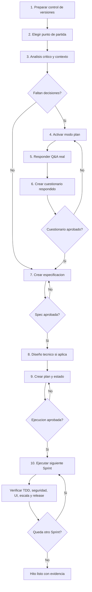

# START HERE - FromZero en este proyecto
<!-- FROMZERO_START_HERE:BEGIN managed=true version=0.4.33 app=Codex -->

Este archivo te dice que acabas de instalar y como empezar a usarlo sin conocer detalles técnicos del plugin.

## Metadatos

| Campo | Valor |
|---|---|
| Artefacto | START_HERE |
| Propósito o subtítulo | Guía inicial del usuario del proyecto |
| Proyecto | Codex |
| Versión del adaptador FromZero | 0.4.33 |
| Fecha de creación | Generada al instalar o actualizar |
| Última actualización | Generada al instalar o actualizar |
| Estado actual | guía activa |
| Historial de estados |  |
| Aprobación del usuario | no aplica |
| Fecha de aprobación |  |
| Frase literal de aprobación |  |
| Artefactos prerequisito | Adaptador `fromzero` instalado |
| Documentos o fuentes asociadas | El agente las detecta en el proyecto |
| Artefactos derivados o relacionados | Gestionados internamente por FromZero |
| Commit asociado |  |
| Restricciones de seguridad | Sin secretos ni `.env` reales. |

## Estado de instalación

- App: Codex.
- Plugin o paquete: `fromzero`.
- Versión: `0.4.33`.
- Instalación: activa en este proyecto.
- Documentación: el agente la detecta en el proyecto.
- Control de versiones al instalar: no detectado; recomendado inicializar antes de empezar.

## 1. Prepara control de versiones

Antes de iniciar FromZero, deja el proyecto bajo Git. No es un requisito para abrir este archivo, pero es la forma segura de trabajar con un agente: guarda un punto de partida limpio, permite revisar cambios por Sprint y permite volver atrás si algo no queda bien.

El estado mostrado arriba se calculó al instalar el plugin. Si inicializaste Git después, revisa el estado actual con el prompt de esta sección.

Si este proyecto todavía no tiene Git, usa este prompt:

```text
Inicializa Git en este proyecto.
Configura exclusiones razonables para el stack detectado.
Haz un primer commit con el estado actual del proyecto.
No ejecutes todavia la metodologia FromZero.
```

Si el proyecto ya tiene Git, usa este prompt:

```text
Revisa el estado de Git de este proyecto.
Dime si hay cambios sin commit antes de iniciar FromZero.
No modifiques archivos todavia.
```

Si decides continuar sin Git, dilo explícitamente. FromZero puede avanzar, pero trabajarás sin un punto de retorno seguro.

## 2. Elige como quieres empezar

Antes de usar cualquiera de estos prompts, crea o usa `docs/` como directorio estándar de insumos del proyecto. Coloca ahí la idea inicial, el PRD o la documentación disponible. Si usas otra ubicación, reemplaza los placeholders con la ruta real.

### Tengo una idea vaga

```text
Quiero crear una aplicacion para [tipo de usuario] que resuelva [problema].
No tengo PRD ni documentacion adicional todavia.
Registra esta idea inicial en docs/PROJECT_BRIEF.md.
Usa FromZero para analizar criticamente la idea, mejorarla, hacer preguntas necesarias y preparar artifacts/FROMZERO_CONTEXT.md.
No implementes codigo de aplicacion todavia.
No avances de fase sin mi aprobación.
```

### Tengo una idea con PRD

```text
Tengo un PRD para este proyecto en [ruta-del-prd].
Si todavía no defini una ruta, usa docs/PRD.md.
Usa FromZero para localizarlo, revisarlo criticamente, detectar gaps, contradicciones, riesgos, supuestos débiles y oportunidades de mejora, y preparar el contexto.
No implementes codigo de aplicacion todavia.
No avances de fase sin mi aprobación.
```

### Tengo documentación en una carpeta

```text
Tengo documentacion para este proyecto en [ruta-de-docs].
Usa FromZero para localizarla, revisarla, analizar criticamente el proyecto, detectar faltantes, contradicciones, riesgos y mejoras, y decirme que decisiones faltan antes de especificar.
No implementes codigo de aplicacion todavia.
No avances de fase sin mi aprobación.
```

## 3. Revisa el primer resultado

FromZero debe preparar el contexto inicial en `artifacts/FROMZERO_CONTEXT.md`.

Ese archivo es el primer resultado que debes revisar. Resume:

- que entendio del proyecto;
- que documentos leyo;
- que analisis critico hizo sobre problema, usuario, mercado, alcance, riesgos y mejoras;
- que gaps o contradicciones encontro;
- que decisiones faltan;
- que riesgos ve;
- que recomienda hacer después.

Si detecta decisiones críticas, FromZero debe detenerse después del contexto y pedir ejecutar el cuestionario en modo plan. En ese punto todavía no debe avanzar a especificación, planificación ni ejecución.

## 4. Ejecuta el cuestionario en modo plan

Si faltan decisiones importantes, FromZero debe pedirte activar el modo plan del agente con un mensaje como este:

> Activa el modo plan de Codex antes de continuar.
> El siguiente paso de la metodología FromZero usa el modo plan para hacer el cuestionario más guiado y fácil de revisar.

El cuestionario debe hacerse como Q&A real usando la UI o herramientas nativas del agente. Activa el modo plan o abre una conversación en modo plan y usa este prompt:

```text
Inicia el cuestionario FromZero de este proyecto.
Hazme las preguntas necesarias para cerrar las decisiones pendientes.
No avances a especificación, planificación ni ejecución todavía.
```

Las preguntas deben estar escritas en lenguaje simple. Si aparece una decisión de interfaz, el agente debe preguntarte cómo quieres definir la interfaz visual: usar la UI de FromZero, usar una referencia externa o dejar UI para después.

El cuestionario puede tener varios ciclos porque las preguntas dependen de la documentación y de tus respuestas. El agente debe mostrar opciones predefinidas, una recomendación basada en lo revisado y una forma de responder con tus propias palabras si ninguna opción encaja o quieres aclarar algo.

Las decisiones que ya estén claras en la documentación no deben preguntarse como si fueran opcionales. El agente debe registrarlas como decisiones asumidas y sólo preguntar si hay contradicción, riesgo, orden de entrega o profundidad por aclarar.

Al terminar el Q&A, FromZero debe guardar el cuestionario completo en el proyecto con respuestas seleccionadas, respuestas abiertas, preguntas diferidas y estado de aprobación. Ese registro es obligatorio antes de continuar porque permite revisar y cambiar respuestas. Esta acción solo guarda el cuestionario; no inicia la siguiente fase.

Responde en lenguaje normal. Puedes usar este prompt:

```text
guarda el cuestionario respondido para revisión y espera mi aprobación antes de continuar.
```

Si el cuestionario existe pero tiene respuestas vacías, `Estado: borrador de preguntas` o `Modo Q&A ejecutado: no`, no lo apruebes todavía: primero ejecuta o continúa el Q&A.

## 5. Revisa y aprueba el cuestionario

Primero revisa el cuestionario. Si quieres cambiar una respuesta, pide el ajuste. Cuando lo apruebes:

```text
Apruebo el cuestionario.
```

Con esa aprobación, FromZero debe crear o actualizar la especificación como siguiente fase si tiene escritura y no hay bloqueos. No debe quedarse solo en "spec habilitada". Si no puede crearla, debe explicar el bloqueo concreto y el siguiente paso. No debe preparar el plan todavía.

Al terminar esta fase, FromZero debe decirte claramente qué revisar y qué responder. Debe dejarte acceso a la especificación, mostrar el commit automático con hash y mensaje completo, y cerrar con un mensaje como este:

> Siguiente paso para ti: revisa y valida la especificación. Si todo está correcto, responde "Apruebo la especificación". Si quieres cambiar algo, dime qué ajuste hago.

## 6. Crea el plan

Cuando revises y apruebes la especificación:

```text
Apruebo la especificación.
```

Con esa aprobación, FromZero debe crear el plan y dejar listo el estado para continuar, sin implementar código de aplicación todavía. Debe dejarte acceso al plan y al estado, mostrar el commit automático con hash y mensaje completo, y decirte si debes revisar, aprobar o pedir correcciones.

Si la especificación implica schemas, APIs, permisos, jobs, cache, migraciones,
integraciones o arquitectura relevante, FromZero debe preparar primero el diseño
técnico. Si no aplica, debe registrar "diseño técnico no requerido" con la razón.

## 7. Ejecuta el siguiente Sprint

Cuando el plan esté listo y revisado:

```text
Apruebo el plan.
Ejecuta el siguiente Sprint aprobado.
```

Para continuar en otra sesión:

```text
Continua con la ejecucion del proyecto.
```

## Flujo visual



## Resultados que debería preparar FromZero

1. Contexto inicial
2. Cuestionario, solo después de ejecutar el Q&A o marcado explícitamente como borrador
3. Especificación
4. Plan
5. Estado de ejecución

## Regla de numeración

FromZero no usa pasos, fases, Sprints ni items visibles numerados como `0`.

El primer paso siempre es `1`, salvo que exista una razón técnica extrema y quede explicada por escrito.
<!-- FROMZERO_START_HERE:END -->
